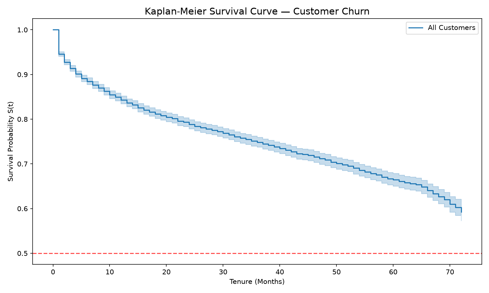
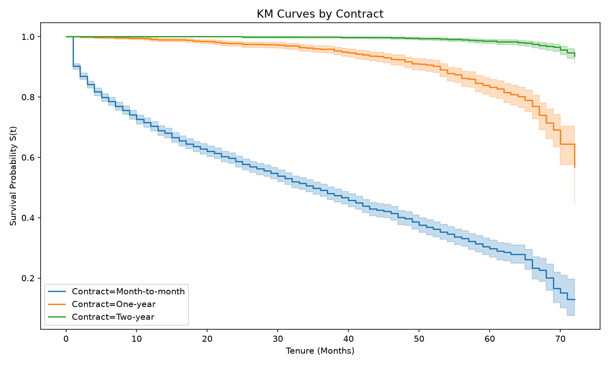
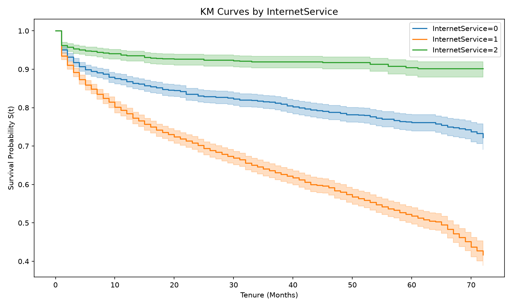

# Survival Analysis for Customer Churn Prediction

> Extending binary churn classification to **time-to-event modelling** using Kaplan-Meier, Cox Proportional Hazards, and Weibull AFT models — predicting not just *if* a customer churns, but *when*.

---

## Why Survival Analysis?

Most churn models answer: **"Will this customer churn?"** (binary classification)

This project answers: **"When will this customer churn?"** (time-to-event modelling)

The distinction matters because:
- A customer likely to churn in month 2 needs immediate intervention
- A customer likely to churn in month 18 can be retained with a lighter-touch strategy
- Standard classifiers ignore **censored observations** — customers still active at observation cutoff — wasting valuable information

Survival analysis handles censoring correctly and produces **survival probability curves per customer segment**, enabling targeted, timing-aware retention strategies.

---

## Dataset

**IBM Telco Customer Churn Dataset**
- 7,043 telecom customers
- 26.5% churn rate | 73.5% censored (still active at observation cutoff)
- Features: contract type, internet service, payment method, monthly charges, tenure, and 17 additional customer attributes
- Duration range: 0–72 months
- Download: [Kaggle — IBM Telco Customer Churn](https://www.kaggle.com/datasets/blastchar/telco-customer-churn)
- Place as `data/Telco-Customer-Churn.csv` after downloading

---

## Project Structure

```
survival-churn-analysis/
├── data/
│   └── Telco-Customer-Churn.csv      ← not tracked by git (see .gitignore)
├── src/
│   ├── preprocessing.py              — survival format preparation + encoding
│   ├── kaplan_meier.py               — KM estimator, group comparison, log-rank test
│   ├── cox_model.py                  — Cox PH model, hazard ratios, C-index, PH test
│   └── aft_model.py                  — Weibull AFT model, model comparison
├── notebooks/
│   └── survival_analysis.ipynb       — end-to-end walkthrough
├── outputs/
│   ├── km_overall.png
│   ├── km_by_contract.png
│   ├── km_by_internet.png
│   └── km_by_payment.png
└── README.md
```

---

## Methodology

### 1. Data Preparation — Survival Format

Survival analysis requires two special columns:

| Column | Description |
|---|---|
| `duration` | How long the customer was observed (tenure in months) |
| `event` | Did churn actually occur? `1 = churned`, `0 = censored (still active)` |

Customers with `Churn = No` are **censored** — we know they survived until the observation cutoff but not when (or if) they will churn. Excluding them would bias results; survival analysis uses them correctly via the partial likelihood function.

### 2. Kaplan-Meier Estimator

Non-parametric estimator of the survival function S(t) = P(customer survives beyond time t).

Used for:
- Visualising overall churn trajectory across the customer base
- Comparing survival curves between groups (contract type, internet service, payment method)
- Log-rank test to assess whether group differences are statistically significant

### 3. Cox Proportional Hazards Model

Semi-parametric regression model estimating how each feature affects the **hazard rate** — the instantaneous risk of churning at time t.

Output: **Hazard Ratio (HR)** per feature
- `HR > 1` → feature increases churn risk
- `HR < 1` → feature decreases churn risk
- `HR = 1` → no effect on churn risk

Model validation: **Proportional Hazards assumption test** using Schoenfeld residuals.

### 4. Weibull AFT Model

Parametric alternative to Cox PH. Outputs **time ratios** — how much a feature multiplies the expected survival time. More robust when PH assumption is violated.

### 5. Evaluation — Concordance Index (C-index)

```
C-index = proportion of correctly ordered customer pairs by churn risk
C-index = 0.5 → random    |    C-index = 1.0 → perfect    |    C-index > 0.7 → good
```

Conceptually equivalent to AUC-ROC but correctly handles censored observations.

---

## Results

### Model Performance

| Model | C-index | Notes |
|---|---|---|
| Cox Proportional Hazards | **0.906** | PH assumption violated for 6 features |
| Weibull AFT | **0.914**  | Better fit, no PH assumption required |
| XGBoost baseline (classification) | ~0.84 ROC-AUC | Binary churn only, ignores timing |

### Survival Probabilities (average customer)

| Time horizon | Survival probability |
|---|---|
| 6 months | 88.0% |
| 12 months | 82.3% |
| 24 months | 73.5% |
| 36 months | 65.6% |
| 48 months | 56.7% |

### Kaplan-Meier — Overall Survival Curve



- Survival starts at 1.0 and declines steadily — churn is continuous, not event-driven
- Steepest decline in **months 0–5** — new customers are highest risk
- Survival curve never crosses 0.5 — majority of customers remain active beyond 72 months

### Kaplan-Meier — By Contract Type



Most dramatic segmentation in the dataset:
- **Month-to-month** → survival drops to ~0.15 by month 72 (85% eventual churn)
- **One-year** → survival stays above 0.60
- **Two-year** → survival stays above 0.93 — extremely sticky

Log-rank test p < 0.001 — difference is highly statistically significant.

### Kaplan-Meier — By Internet Service & Payment Method



- **Fiber optic** customers churn at nearly 2× the rate of DSL customers despite paying more
- **Electronic check** payment method shows survival dropping to ~0.30 — strongest payment signal

### Cox PH — Top Hazard Ratios

| Feature | Hazard Ratio | Interpretation |
|---|---|---|
| Contract | **0.49** | Each contract tier upgrade reduces churn hazard by 51% |
| OnlineSecurity | **0.75** | Security add-on reduces churn hazard by 25% |
| TechSupport | **0.79** | Tech support reduces churn hazard by 21% |
| PaperlessBilling | **1.29** | Paperless billing increases churn hazard by 29% |
| PaymentMethod | **1.18** | Electronic check tier increases hazard by 18% |
| Gender | **0.96** (p=0.32) | Not statistically significant |

### Proportional Hazards Assumption Test

6 features violated the PH assumption (p < 0.05): Contract, MonthlyCharges, MultipleLines, StreamingMovies, StreamingTV, TotalCharges. This indicates their effect on churn risk **changes over time** — motivating the Weibull AFT model as the preferred final model.

### Business Recommendations

1. **Prioritise months 1–6 interventions** — survival curve drops steepest here. Onboarding retention programmes have highest ROI in this window.

2. **Contract upgrade campaigns** — month-to-month customers have 51% higher churn hazard per contract tier. A targeted upgrade offer in month 3 could significantly improve 12-month survival.

3. **Fiber optic + electronic check segment** — customers with both characteristics show the steepest combined survival decline. Priority cohort for proactive retention spend.

4. **Online security and tech support upsell** — both reduce churn hazard by 20–25%. Cross-selling these add-ons is a retention lever, not just a revenue lever.

---

## How This Extends the Churn Classification Project

| Dimension | Churn Classification | This Project |
|---|---|---|
| Question answered | Will customer churn? | When will customer churn? |
| Model type | XGBoost classifier | Cox PH + Weibull AFT |
| Handles censoring | No | Yes |
| Output | Churn probability (0–1) | Survival curve S(t) per customer |
| Evaluation metric | ROC-AUC 0.84 | C-index 0.914 |
| Business output | Risk score | Time-to-churn per segment |
| Explainability | SHAP values | Hazard ratios |

---

## Installation

```bash
pip install lifelines matplotlib pandas scikit-learn numpy
```

---

## Usage

```bash
# Run full analysis
jupyter notebook notebooks/survival_analysis.ipynb
```

---

## Key Concepts for Interviews

**Q: What is censoring and why does it matter?**
Customers still active at observation cutoff are censored — we know they survived until that point but not when they'll churn. Ignoring them biases the model toward overestimating churn risk. Survival analysis uses censored observations correctly via the partial likelihood function.

**Q: How is C-index different from AUC-ROC?**
Both measure ranking ability — how well the model orders customers by risk. AUC-ROC works for binary outcomes at a fixed time point. C-index works for time-to-event outcomes and correctly handles censored observations by only comparing pairs where the ordering is unambiguously observable.

**Q: Why Cox PH instead of logistic regression?**
Logistic regression ignores *when* churn happens and discards censored observations. Cox PH uses all available information including censored customers, produces time-varying survival probabilities, and estimates feature effects on churn timing — not just churn probability.

**Q: What is the proportional hazards assumption and what did you find?**
Cox PH assumes hazard ratios remain constant over time. Our Schoenfeld residuals test found 6 features violated this assumption — particularly Contract and MonthlyCharges — meaning their effect on churn risk changes across the customer lifecycle. This motivated switching to the Weibull AFT model as the final model, which achieved a superior C-index of 0.914.

**Q: What does a hazard ratio of 0.49 for Contract mean?**
Each one-unit increase in contract tier (month-to-month → one-year → two-year) reduces the instantaneous churn hazard by 51%. A two-year contract customer has roughly one-quarter the churn hazard of a month-to-month customer at any given point in time.

---

## Tech Stack


- **lifelines** — survival analysis (KM, Cox PH, Weibull AFT)
- **scikit-learn** — preprocessing, label encoding
- **pandas / numpy** — data manipulation
- **matplotlib** — survival curve visualisation

---

## References

- Cox, D.R. (1972). Regression models and life-tables. *Journal of the Royal Statistical Society*
- Davidson-Pilon, C. — lifelines documentation: `lifelines.readthedocs.io`
- IBM Telco Customer Churn Dataset — [Kaggle](https://www.kaggle.com/datasets/blastchar/telco-customer-churn)

---

## Author

**Ranjeeta Mashal**
Dual Degree (B.Tech + M.Tech), Metallurgical & Materials Engineering
IIT Kharagpur | [GitHub](https://github.com/Ran0421) | ranjeetamashal0421@gmail.com
